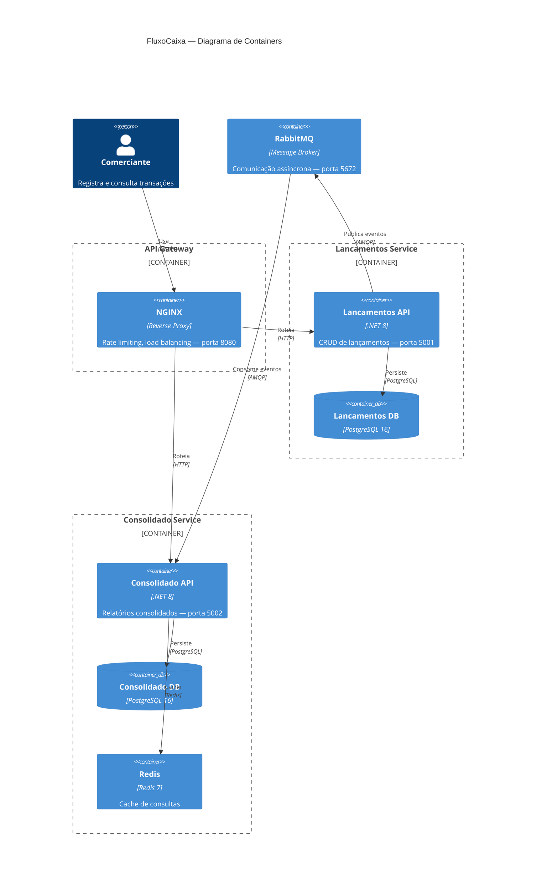

# FluxoCaixa — Controle de Fluxo de Caixa

Sistema de controle de fluxo de caixa com microsserviços para registro de lançamentos financeiros e geração de relatórios de saldo diário consolidado.

## Arquitetura

### Visão Geral

O sistema é composto por dois microsserviços independentes que se comunicam de forma assíncrona via RabbitMQ, garantindo que o serviço de lançamentos permaneça disponível mesmo quando o serviço de consolidado estiver indisponível.



### Stack Tecnológica

| Componente | Tecnologia | Justificativa |
|---|---|---|
| Linguagem | C# / .NET 8 | Performance, tipagem forte, LTS |
| Banco de Dados | PostgreSQL 16 | Open-source, ACID, robusto para transações financeiras |
| Cache | Redis 7 | Sub-milissegundo de latência para 50 req/s |
| Mensageria | RabbitMQ 3 | Filas duráveis, desacoplamento entre serviços |
| API Gateway | NGINX | Rate limiting, load balancing |
| Containers | Docker + Docker Compose | Portabilidade, ambiente reproduzível |
| Testes | xUnit + FluentAssertions + Testcontainers + k6 | Cobertura completa |
| Resiliência | Polly | Circuit Breaker, Retry, Timeout, Bulkhead |
| ORM | Entity Framework Core 8 | Code-first, migrations |
| CQRS | MediatR | Separação Commands/Queries |

## Pré-requisitos

- [Docker](https://www.docker.com/) >= 24.x
- [Docker Compose](https://docs.docker.com/compose/) >= 2.x
- [.NET 8 SDK](https://dotnet.microsoft.com/download/dotnet/8.0) (para desenvolvimento local)
- [k6](https://k6.io/docs/get-started/installation/) (para testes de carga, opcional)

## Como Executar Localmente

### 1. Clonar o repositório
```bash
git clone https://github.com/yuriandrade91/challenge-solutions-architect.git
cd challenge-solutions-architect
```

### 2. Subir toda a infraestrutura com Docker Compose
```bash
docker-compose up -d
```

### 3. Verificar saúde dos serviços
```bash
# Lancamentos API
curl http://localhost:5001/health

# Consolidado API
curl http://localhost:5002/health

# Via NGINX (API Gateway)
curl http://localhost:8080/health/lancamentos
curl http://localhost:8080/health/consolidado
```

### 4. Acessar interfaces de gestão
- **RabbitMQ Management**: http://localhost:15672 (guest/guest)
- **Prometheus**: http://localhost:9090
- **Grafana**: http://localhost:3000 (admin/admin)
- **Swagger Lancamentos**: http://localhost:5001/swagger
- **Swagger Consolidado**: http://localhost:5002/swagger

## API Endpoints

### Lançamentos Service (porta 5001)

#### Criar Lançamento
```bash
curl -X POST http://localhost:5001/api/v1/lancamentos \
  -H "Content-Type: application/json" \
  -d '{
    "idempotencyKey": "550e8400-e29b-41d4-a716-446655440000",
    "tipo": "CREDIT",
    "valor": 1500.00,
    "descricao": "Venda produto X",
    "categoria": "Vendas",
    "dataLancamento": "2024-01-15"
  }'
```

#### Listar Lançamentos por Período
```bash
curl "http://localhost:5001/api/v1/lancamentos?dataInicio=2024-01-01&dataFim=2024-01-31&page=1&pageSize=20"
```

#### Buscar Lançamento por ID
```bash
curl http://localhost:5001/api/v1/lancamentos/{id}
```

#### Atualizar Lançamento
```bash
curl -X PUT http://localhost:5001/api/v1/lancamentos/{id} \
  -H "Content-Type: application/json" \
  -d '{
    "valor": 2000.00,
    "descricao": "Venda produto X - atualizado",
    "categoria": "Vendas"
  }'
```

#### Cancelar Lançamento
```bash
curl -X DELETE http://localhost:5001/api/v1/lancamentos/{id}
```

### Consolidado Service (porta 5002)

#### Consultar Consolidado por Data
```bash
curl http://localhost:5002/api/v1/consolidado/2024-01-15
```

#### Consultar Consolidado por Período
```bash
curl "http://localhost:5002/api/v1/consolidado?dataInicio=2024-01-01&dataFim=2024-01-31"
```

### Formato de Resposta
```json
{
  "success": true,
  "data": { "..." },
  "error": null,
  "pagination": { "page": 1, "pageSize": 20, "totalItems": 100, "totalPages": 5 },
  "metadata": { "requestId": "...", "timestamp": "2024-01-15T10:00:00Z", "cacheHit": false }
}
```

## Como Executar os Testes

### Testes Unitários
```bash
# Todos os testes unitários
dotnet test tests/UnitTests/FluxoCaixa.Lancamentos.UnitTests/
dotnet test tests/UnitTests/FluxoCaixa.Consolidado.UnitTests/
```

### Testes de Integração
> **Nota**: Requer Docker para subir Testcontainers (PostgreSQL, RabbitMQ, Redis)

```bash
dotnet test tests/IntegrationTests/FluxoCaixa.Lancamentos.IntegrationTests/
dotnet test tests/IntegrationTests/FluxoCaixa.Consolidado.IntegrationTests/
```

### Testes de Carga (k6)
> **Nota**: Requer k6 instalado e a aplicação rodando

```bash
# Teste de carga do Consolidado (50 req/s, 5 minutos)
k6 run -e BASE_URL=http://localhost:8080 tests/LoadTests/consolidado-load-test.js

# Teste de carga do Lancamentos
k6 run -e BASE_URL=http://localhost:8080 tests/LoadTests/lancamentos-load-test.js
```

## Estrutura do Projeto

```
├── docs/
│   ├── architecture-decision-records/  # ADRs (ADR-001 a ADR-005)
│   ├── diagrams/                        # Diagramas C4 em Mermaid
│   ├── api/openapi.yaml                 # Especificação OpenAPI 3.0
│   └── requisitos/                      # Requisitos funcionais e não funcionais
│
├── src/
│   ├── Lancamentos/                     # Microsserviço de Lançamentos
│   │   ├── FluxoCaixa.Lancamentos.Api          # API REST (porta 5001)
│   │   ├── FluxoCaixa.Lancamentos.Application  # CQRS: Commands, Queries
│   │   ├── FluxoCaixa.Lancamentos.Domain       # Entidades, Eventos, Regras
│   │   └── FluxoCaixa.Lancamentos.Infrastructure # EF Core, RabbitMQ
│   │
│   ├── Consolidado/                     # Microsserviço de Consolidado
│   │   ├── FluxoCaixa.Consolidado.Api          # API REST (porta 5002)
│   │   ├── FluxoCaixa.Consolidado.Application  # Event Handlers, Queries
│   │   ├── FluxoCaixa.Consolidado.Domain       # Entidade ConsolidadoDiario
│   │   └── FluxoCaixa.Consolidado.Infrastructure # EF Core, RabbitMQ, Redis
│   │
│   └── Shared/FluxoCaixa.Shared        # Eventos de integração, Polly
│
├── tests/
│   ├── UnitTests/                       # Testes unitários (xUnit + FluentAssertions)
│   ├── IntegrationTests/                # Testes de integração (Testcontainers)
│   └── LoadTests/                       # Testes de carga (k6)
│
├── database/                            # Scripts SQL iniciais
├── infra/nginx/                         # Configuração do API Gateway
├── infra/prometheus/                    # Configuração do Prometheus
├── docker-compose.yml                   # Toda a infraestrutura
└── FluxoCaixa.slnx                      # Solution file (.NET)
```

## Documentação Adicional

- [ADR-001: Microsserviços](docs/architecture-decision-records/ADR-001-microsservicos.md)
- [ADR-002: RabbitMQ](docs/architecture-decision-records/ADR-002-mensageria-rabbitmq.md)
- [ADR-003: CQRS](docs/architecture-decision-records/ADR-003-cqrs.md)
- [ADR-004: Stack Tecnológica](docs/architecture-decision-records/ADR-004-stack-tecnologica.md)
- [ADR-005: Cache Strategy](docs/architecture-decision-records/ADR-005-cache-strategy.md)
- [Requisitos Funcionais](docs/requisitos/requisitos-funcionais.md)
- [Requisitos Não Funcionais](docs/requisitos/requisitos-nao-funcionais.md)
- [Regras de Negócio](docs/requisitos/regras-negocio.md)
- [Diagramas C4](docs/diagrams/c4-diagrams.md)
- [OpenAPI Spec](docs/api/openapi.yaml)

## Decisões Arquiteturais Principais

1. **Microsserviços**: Isolamento de falhas — Lançamentos continua operando se Consolidado cair (RNF02)
2. **RabbitMQ assíncrono**: Desacoplamento entre serviços, mensagens persistidas em fila durável
3. **CQRS com MediatR**: Separação clara de leitura/escrita, testabilidade
4. **Redis Cache**: Atende 50 req/s no Consolidado com p95 < 500ms (RNF03, RNF04)
5. **Idempotência**: `idempotency_key` previne lançamentos duplicados (RN07)
6. **Polly Resiliência**: Circuit Breaker, Retry, Timeout para comunicações externas
