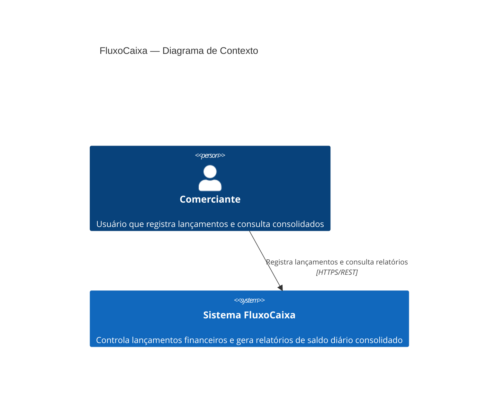
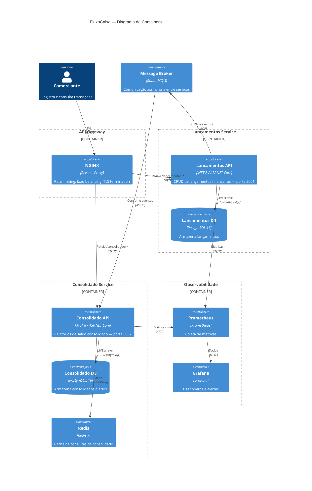
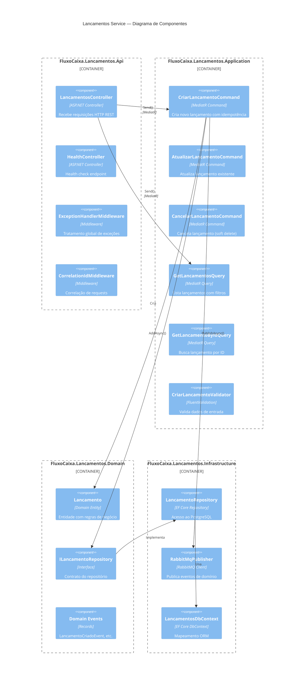
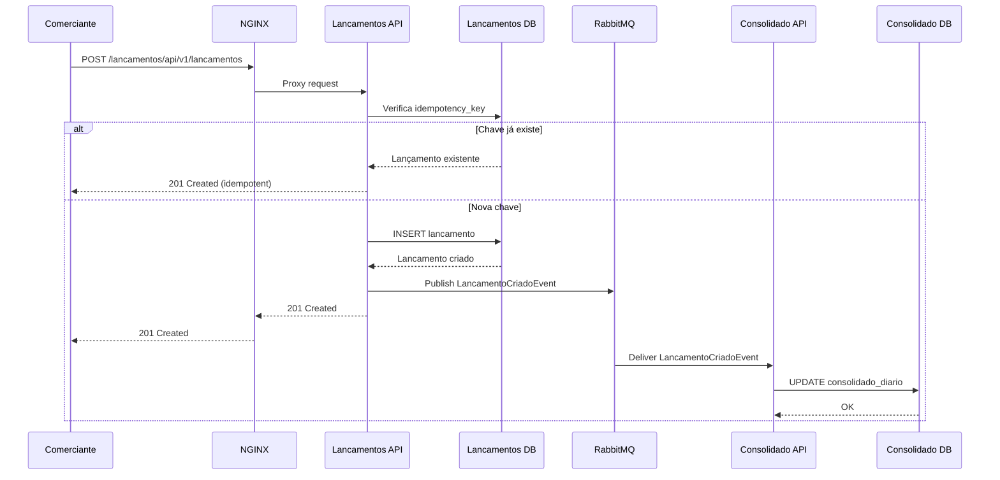

# C4 Diagrams — FluxoCaixa

## Level 1: Context Diagram

```mermaid
C4Context
    title FluxoCaixa — Diagrama de Contexto

    Person(comerciante, "Comerciante", "Usuário que registra lançamentos e consulta consolidados")

    System(fluxocaixa, "Sistema FluxoCaixa", "Controla lançamentos financeiros e gera relatórios de saldo diário consolidado")

    Rel(comerciante, fluxocaixa, "Registra lançamentos e consulta relatórios", "HTTPS/REST")
```

## Level 2: Container Diagram

```mermaid
C4Container
    title FluxoCaixa — Diagrama de Containers

    Person(comerciante, "Comerciante", "Registra e consulta transações")

    Container_Boundary(gateway, "API Gateway") {
        Container(nginx, "NGINX", "Reverse Proxy", "Rate limiting, load balancing, TLS termination")
    }

    Container_Boundary(lancamentos, "Lancamentos Service") {
        Container(lancamentos_api, "Lancamentos API", ".NET 8 / ASP.NET Core", "CRUD de lançamentos financeiros — porta 5001")
        ContainerDb(lancamentos_db, "Lancamentos DB", "PostgreSQL 16", "Armazena lançamentos")
    }

    Container_Boundary(consolidado, "Consolidado Service") {
        Container(consolidado_api, "Consolidado API", ".NET 8 / ASP.NET Core", "Relatórios de saldo consolidado — porta 5002")
        ContainerDb(consolidado_db, "Consolidado DB", "PostgreSQL 16", "Armazena consolidados diários")
        Container(redis, "Redis", "Redis 7", "Cache de consultas de consolidado")
    }

    Container(rabbitmq, "Message Broker", "RabbitMQ 3", "Comunicação assíncrona entre serviços")

    Container_Boundary(observability, "Observabilidade") {
        Container(prometheus, "Prometheus", "Prometheus", "Coleta de métricas")
        Container(grafana, "Grafana", "Grafana", "Dashboards e alertas")
    }

    Rel(comerciante, nginx, "Usa", "HTTPS")
    Rel(nginx, lancamentos_api, "Roteia /lancamentos/*", "HTTP")
    Rel(nginx, consolidado_api, "Roteia /consolidado/*", "HTTP")
    Rel(lancamentos_api, lancamentos_db, "Lê/Escreve", "TCP/PostgreSQL")
    Rel(lancamentos_api, rabbitmq, "Publica eventos", "AMQP")
    Rel(rabbitmq, consolidado_api, "Consome eventos", "AMQP")
    Rel(consolidado_api, consolidado_db, "Lê/Escreve", "TCP/PostgreSQL")
    Rel(consolidado_api, redis, "Cache", "TCP/Redis")
    Rel(lancamentos_api, prometheus, "Métricas", "HTTP")
    Rel(consolidado_api, prometheus, "Métricas", "HTTP")
    Rel(prometheus, grafana, "Dados", "HTTP")
```

## Level 3: Component Diagram — Lancamentos Service

```mermaid
C4Component
    title Lancamentos Service — Diagrama de Componentes

    Container_Boundary(api, "FluxoCaixa.Lancamentos.Api") {
        Component(controller, "LancamentosController", "ASP.NET Controller", "Recebe requisições HTTP REST")
        Component(health, "HealthController", "ASP.NET Controller", "Health check endpoint")
        Component(middleware_exc, "ExceptionHandlerMiddleware", "Middleware", "Tratamento global de exceções")
        Component(middleware_cor, "CorrelationIdMiddleware", "Middleware", "Correlação de requests")
    }

    Container_Boundary(app, "FluxoCaixa.Lancamentos.Application") {
        Component(criar_cmd, "CriarLancamentoCommand", "MediatR Command", "Cria novo lançamento com idempotência")
        Component(atualizar_cmd, "AtualizarLancamentoCommand", "MediatR Command", "Atualiza lançamento existente")
        Component(cancelar_cmd, "CancelarLancamentoCommand", "MediatR Command", "Cancela lançamento (soft delete)")
        Component(get_query, "GetLancamentosQuery", "MediatR Query", "Lista lançamentos com filtros")
        Component(getid_query, "GetLancamentoByIdQuery", "MediatR Query", "Busca lançamento por ID")
        Component(validator, "CriarLancamentoValidator", "FluentValidation", "Valida dados de entrada")
    }

    Container_Boundary(domain, "FluxoCaixa.Lancamentos.Domain") {
        Component(entity, "Lancamento", "Domain Entity", "Entidade com regras de negócio")
        Component(repo_iface, "ILancamentoRepository", "Interface", "Contrato do repositório")
        Component(events, "Domain Events", "Records", "LancamentoCriadoEvent, etc.")
    }

    Container_Boundary(infra, "FluxoCaixa.Lancamentos.Infrastructure") {
        Component(repo, "LancamentoRepository", "EF Core Repository", "Acesso ao PostgreSQL")
        Component(publisher, "RabbitMqPublisher", "RabbitMQ Client", "Publica eventos de domínio")
        Component(dbctx, "LancamentosDbContext", "EF Core DbContext", "Mapeamento ORM")
    }

    Rel(controller, criar_cmd, "Send()", "MediatR")
    Rel(controller, get_query, "Send()", "MediatR")
    Rel(criar_cmd, entity, "Cria", "")
    Rel(criar_cmd, repo_iface, "AddAsync()", "")
    Rel(criar_cmd, publisher, "PublishAsync()", "")
    Rel(repo_iface, repo, "Implementa", "")
    Rel(repo, dbctx, "Usa", "")
```

## Sequence Diagram — Criar Lançamento

```mermaid
sequenceDiagram
    participant C as Comerciante
    participant N as NGINX
    participant L as Lancamentos API
    participant DB as Lancamentos DB
    participant MQ as RabbitMQ
    participant CO as Consolidado API
    participant CDB as Consolidado DB

    C->>N: POST /lancamentos/api/v1/lancamentos
    N->>L: Proxy request
    L->>DB: Verifica idempotency_key
    alt Chave já existe
        DB-->>L: Lançamento existente
        L-->>C: 201 Created (idempotent)
    else Nova chave
        L->>DB: INSERT lancamento
        DB-->>L: Lancamento criado
        L->>MQ: Publish LancamentoCriadoEvent
        L-->>N: 201 Created
        N-->>C: 201 Created
        MQ->>CO: Deliver LancamentoCriadoEvent
        CO->>CDB: UPDATE consolidado_diario
        CDB-->>CO: OK
    end
```
